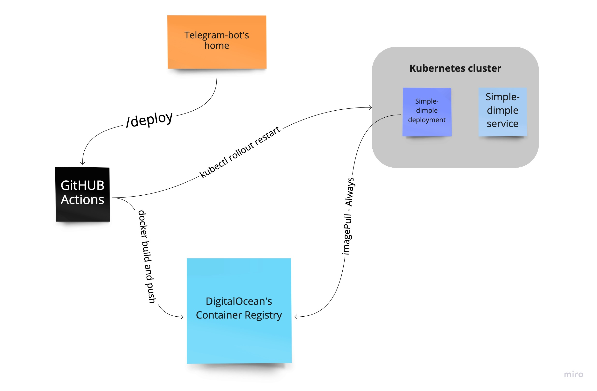
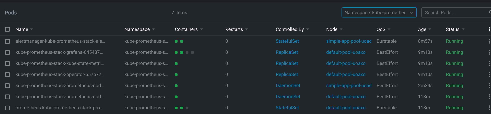
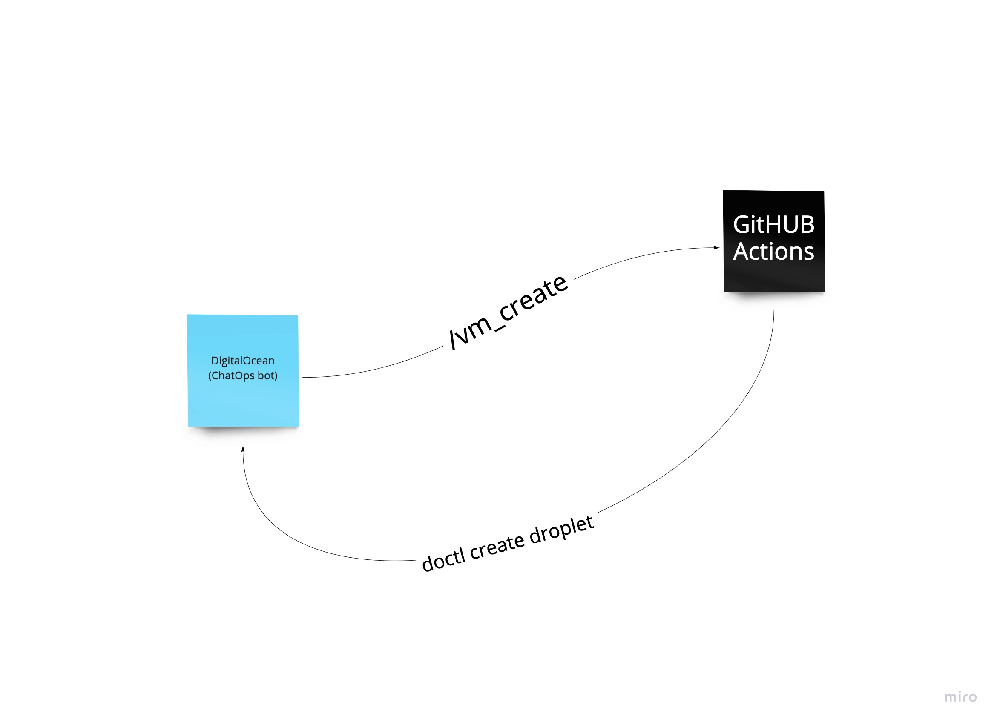
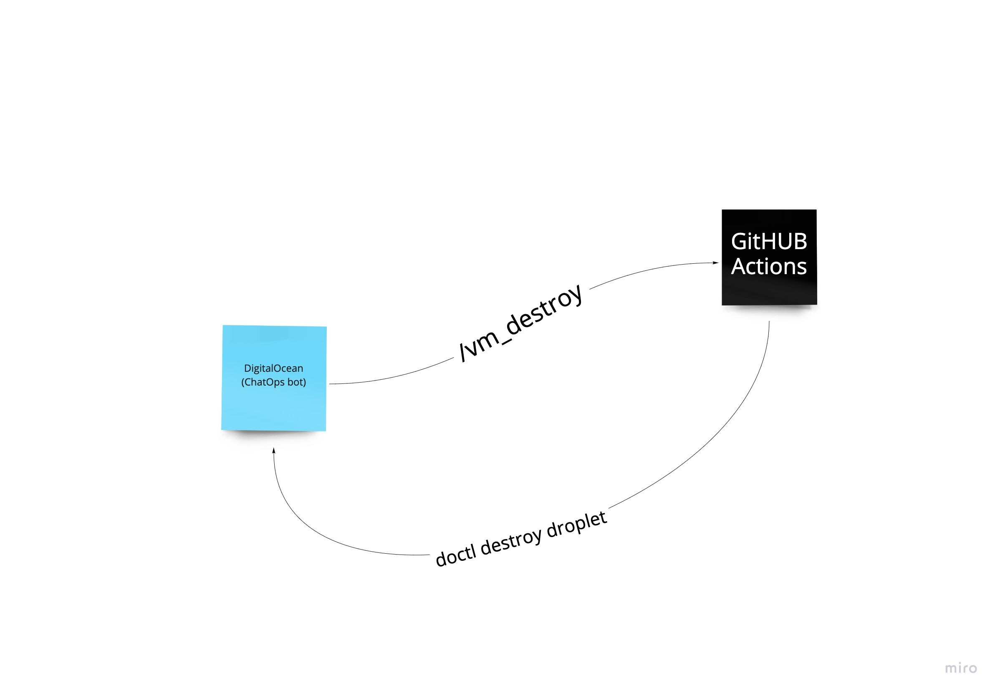

# telegram-chatops
Codebase of the app, its infra, and chat-bot which triggers the deployment

## Link to the bot: https://t.me/DeployTriggerBot

## Link to the simple-dimple-app: http://174.138.106.54:8080/

Simple-dimple app is just a small web-server which gives you the time when application was deployed.
So, it is very simple. My bot is sitting as a docker container on the DigitalOcean. 
After making ``/deploy`` command - telegram-bot sends POST request to the GitHUB actions
which runs new workflow. It builds and pushes new image to the container registry.

After new image appears in the Container registry the rollout on the K8s happens.

# Technologies - reasons:

* Python - I am on vacation with a few hours per day available to do this work, so I need something fast to write
* DigitalOcean - No experience, I want to try
* GitHUB Actions - the same as DO
* Terraform - nice tool to rollout new infra very quickly and also no one knows where is my tfstate (haha)
* Kubernetes - HA, easy to scale (that simple-dimple app) and a lot of features
* Lens - I've used to it and also I like its monitoring windows 
* Monitoring - installed on the DO, here is my monitoring pods:

# FREEBSD !!! and KDE

So, I've used the same DigitalOcean, but unfortunately they put me a limit on the droplets creation, so we can create only one additional node, the next one is only after destroying. But I've put the logic to my bot that it will not execute simultaneously multiple creations.

How does it works (very simple):

* vm_create

* vm_destroy 

Unfortunately, I just could find the way to install old KDE on the FreeBSD, so the image from which VM is setting up already has KDE installed.
I've done it via configuring FreeBSD with all of stuff inside the box and making a snapshot.

